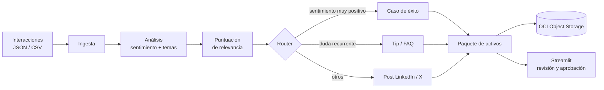

# CommunityLab

Motor inteligente de transformación y distribución para comunidades digitales.
Proyecto del Hackathon ONE G10 (Oracle Next Education & Alura, Grupo 10).

Recibe interacciones de una comunidad (mensajes, dudas, testimonios, entregas), las analiza
con un LLM y genera activos de marketing listos para publicar, que guarda en OCI Object
Storage.

> Estado: base del repositorio. Ver [plan por fases](docs/plan-por-fases.md).

## Arquitectura



Los nodos de generación y la lista de formatos pueden cambiar durante el desarrollo; el
diagrama se mantiene sincronizado con `src/communitylab/grafo.py`.

## Stack

Python · LangGraph · LangChain + Gemini (capa gratuita) · Streamlit · OCI Object Storage
(Always Free).

## Guía de despliegue local (PowerShell, Windows)

1. Clona el repositorio del equipo (`git clone https://github.com/No-Country-simulation/G10-LATAM-CommunityLab-equipo47.git`) y cambia a tu rama personal (la de Roberto es `prot_rober`).
2. Entorno: `uv venv` y `.venv\Scripts\Activate.ps1`
3. Dependencias: `uv pip install -r requirements.txt`
4. Configuración: copia `.env.example` a `.env` y rellena `GEMINI_API_KEY`, `GEMINI_MODEL`
   y `OCI_NAMESPACE`.
5. OCI: configura la CLI y tu perfil `DEFAULT` en `~/.oci/config` (clave de API) y crea un
   bucket privado Standard en tu compartimento (solo Always Free).
6. Interfaz: `streamlit run app/streamlit_app.py` (disponible desde la fase 6).

### Agente de desarrollo (opcional, OpenCode)

Copia `opencode.example.json` a `opencode.json` y sustituye `RUTA_COMPLETA_A_uvx.exe` por la
ruta real de tu `uvx.exe`. Crea el perfil de sesión del MCP con
`oci session authenticate --region sa-santiago-1 --tenancy-name <tu-tenancy> --profile-name communitylab`.
El token caduca en unos 60 minutos: `oci session refresh --profile communitylab`.

## Datos de ejemplo

En `data/entrada/` hay 3 lotes simulados para la demostración: `ejemplo_1_contratacion.json`,
`ejemplo_2_soporte_dudas.json` y `ejemplo_3_feedback_mixto.json`. El formato del resultado
está en [docs/esquema-paquete-distribucion.md](docs/esquema-paquete-distribucion.md), con un
[ejemplo](docs/ejemplo-paquete-distribucion.json).

## Estructura

```
src/communitylab/   lógica: ingesta, análisis, puntuación, router, generadores, OCI, grafo
app/                interfaz Streamlit
prompts/            prompts por canal (con ejemplos few-shot)
data/entrada/       datos simulados
tests/              pruebas con pytest
docs/               documentación y plan
AGENTS.md           reglas para el agente de desarrollo
MEMORY.md           memoria del proyecto entre sesiones
```

## Convención de objetos en OCI

`entradas/AAAA-semana-NN/` · `informes/AAAA-semana-NN/` · `activos/AAAA-semana-NN/`
(incluye `paquete-distribucion.json`).

## Flujo de trabajo en equipo

Cada integrante trabaja en su rama personal. Tras la revisión de los compañeros, se
integra a `dev` y, si se aprueba, a `main`. Commits con prefijo `feat:`, `fix:`, `docs:`,
`test:` o `chore:`.

## Requisitos mínimos de la consigna

- [ ] Ingestión de interacciones (JSON o CSV)
- [ ] Sentimiento y temas con LLM
- [ ] Al menos 2 formatos de activos
- [ ] Orquestación del flujo (LangGraph)
- [ ] Integración activa con OCI Object Storage
- [ ] Demostración con 3 ejemplos
- [ ] Repositorio con historial organizado, diagrama y guía de despliegue
